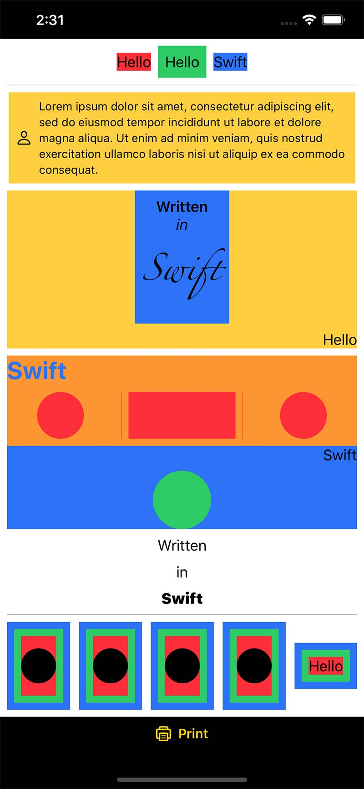
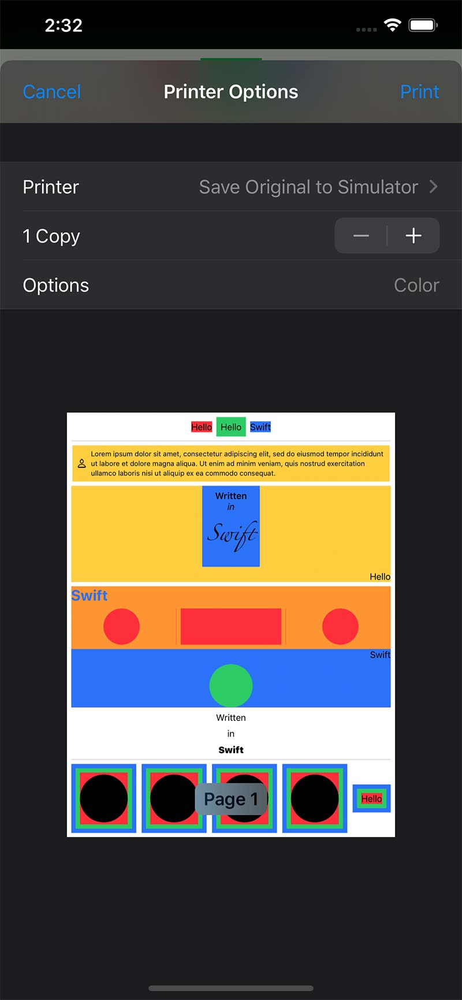
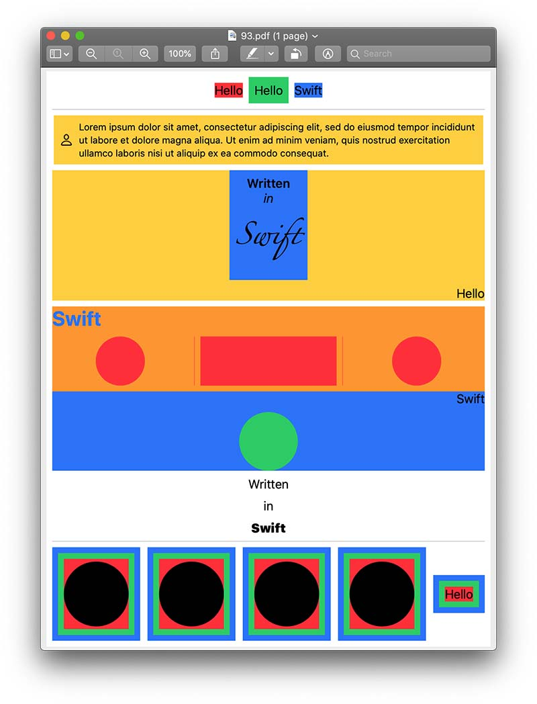

# WolfPrint

A SwiftUI-inspired framework for laying out elements in a CGContext, primarily intended for printing.

This started as a fork of [OpenSwiftUI](https://github.com/Cosmo/OpenSwiftUI) but has diverged considerably. I have implemented a number of features I needed that weren't yet working in OpenSwiftUI.

Although I have used this for one serious project, I don't recommend it for production yet. I am aware it is full of bugs and incompletenesses. Please don't file bug reports at this time. Pull requests are welcome.

The demo app is a separate project [here](https://github.com/WolfMcNally/WolfPrintDemo).

The image you are seeing was rendered directly via WolfPrint using SwiftUI-style code. Here is the code for the third section:

```swift
VStack {
    VStack(spacing: 0) {
        Text("Written")
            .bold()
        Text("in")
            .italic()
        Text("Swift")
            .font(.custom("Zapfino", size: 28))
    }
    .padding()
    .background(Color.blue)
    HStack {
        Spacer()
        Text("Hello")
    }
}
.background(Color.yellow)
```

### The demo application window.



### Clicking the Print button at the bottom shows the Print Preview screen.



### Printing to PDF results in this displayed in Preview.



The final PDF file is [here](Images/PDF.pdf).
